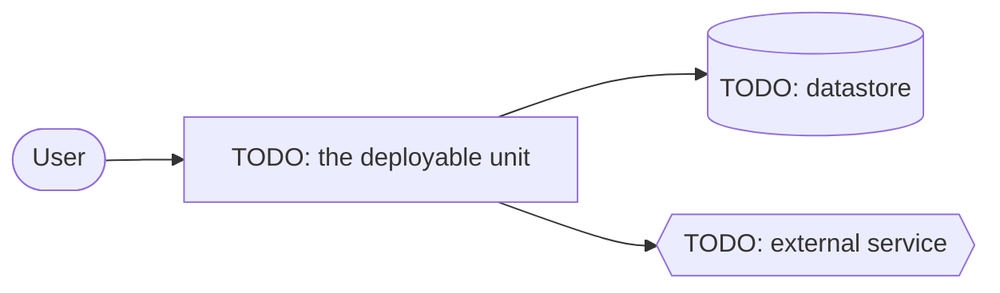

# High-level design

One view of this system at container level: what runs, what holds state, what it talks to across a
trust boundary. The design stage amends it — `.sdlc/flow.yaml` names this path under
`stages.design.diagram`, and G6 in `.sdlc/upstream/standards/engineering-guardrails.md` binds a change to it.

Two rules keep it worth reading:

- **One box per deployable unit, datastore, external service or boundary.** Component-level detail
  belongs in the spec that introduces it. Detail here goes stale unread, and a stale diagram is
  worse than none.
- **Text, never an image.** An amendment has to be a diff a reviewer can read, and a drawing tool's
  export is not one.

<!-- TEMPLATE: replace the diagram and the table below with this system. -->

## What moved, and when

| Date | What changed | Spec |
|---|---|---|
| | | |
