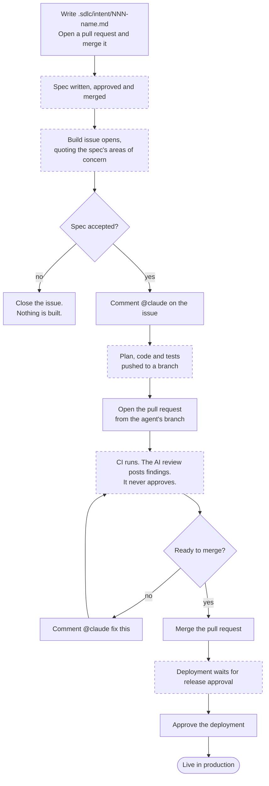

# Developer workflow

How one change travels from an idea to production, and which steps a person performs.

A solid outline is a step someone performs. A dashed outline happens on its own.

## The five actions

Everything between them is automatic. Nothing reaches production without a person acting.

| # | Action | Where | Who |
|---|---|---|---|
| 1 | Write the intent, open a pull request, merge it | `.sdlc/intent/<slug>.md` | author, then code owner |
| 2 | Comment `@claude` to accept the spec and start the build | the Build issue | product owner |
| 3 | Open the pull request from the agent's branch | the *Create PR* link | author |
| 4 | Merge once CI and the review look right | the pull request | code owner |
| 5 | Approve the release | the `production` environment | release manager |

One slug — `NNN-<short-name>` — ties the chain together:
`.sdlc/intent/<slug>.md` → `.sdlc/specs/<slug>.md` → `.sdlc/plans/<slug>.md` → pull request.

## Four things worth knowing

**Step 2 is the rejection point.** Closing the Build issue instead of commenting is how a spec is
turned down. A design exists by then; no code has been written. There is no other place in the loop
where a change can be stopped before work begins.

**The review stage is a cycle, not a step.** `@claude fix this` sends the change back through CI and
review. The arrow returns for that reason.

**The agent never passes a gate.** It writes artefacts, proposes code and posts findings. It does not
approve a pull request, merge one, or release. The single automatic approval is the spec, and the
pipeline grants it — not the agent — so that the decision moves to the Build issue instead of
disappearing.

**Three stages produce a file, one produces an issue.** Intent, spec and plan are artefacts, so each
arrives as a pull request. The build stage has no file to show yet, so its gate lives on an issue.

## Related

- [ONBOARDING.md](ONBOARDING.md) — adopting the loop in a new repository
- [README.md](README.md) — what each file does and why the loop is shaped this way
- `.sdlc/flow.yaml` — the same stages and gates, in machine-readable form
