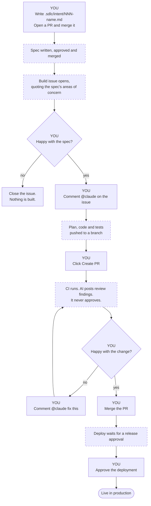

# Onboarding a project onto the SDLC template

The runbook for adopting the loop. `README.md` explains what it is and why; this is what you do.

## What you are signing up for

- **15 files stop being yours.** Everything named in `.sdlc/invariant.txt` — the shell machinery,
  the hooks that stop the agent passing a gate, the eval that proves they block. `ci / test` fails
  if you edit them. Change them by proposing a change upstream, not locally.
- **The standard keeps arriving.** `sdlc-update.yml` runs weekly and opens a PR when a newer tag
  exists. It goes through your CI, your evals and your review. You merge it, or you do not.
- **Every gate stays human.** The agent writes artefacts and findings. It never approves, merges or
  releases. The one automatic approval is the spec PR, and the pipeline grants it, not the agent.

## Before you start

- A repo you can make public, or a paid plan — required reviewers on a `production` environment and
  code-owner approval are not available on private repos on the free plan.
- `gh` authenticated with the `workflow` scope: `gh auth refresh -h github.com -s workflow`.
- A Claude Code token: `claude setup-token`.

---

## 1. Bootstrap — one command

```bash
gh repo create <owner>/<app> --template kayshn/poc-sdlc-template --clone --public
cd <app>
./.sdlc/scripts/sdlc_update.sh --source kayshn/poc-sdlc-template
```

That pins the newest tag in `.sdlc/TEMPLATE_VERSION`, repoints every thin caller workflow at it, and
deletes the local `_*.yml` bodies — inert in a consumer, because `workflow_call` never self-fires.

**Done when** `make template-check` reports everything except *make lint and make test are wired up*.

## 2. Reach your stack — the only blocking step

`make lint` and `make test` ship failing on purpose: a green check that ran nothing is worse than a
red one.

1. **`Makefile`** — replace the bodies of `install`, `lint`, `test`, `format`, `run`. Keep the names;
   the workflows call them and nothing else. Leave everything below the *nothing below this line is
   stack-specific* marker alone. There is no toolchain setup in any workflow: the runners preinstall
   `python3`, `node`, `jq`, `awk` and `yq`, so `make install` provisions the rest — a virtualenv, a
   JDK, whatever you need.
2. **`.gitignore`** — add your build output and dependency directories.

**Done when** `make install && make lint && make test && make flow-check && make template-check` is
green locally. That is the whole of CI.

## 3. Make the agent useful

None of this is enforced by a check. It is the difference between an agent that helps and one that
produces plausible noise.

| File | Do |
|---|---|
| `CLAUDE.md` | Fill in every `<...>`. *Conventions* and *Things the agent gets wrong* are what actually steer it — name real symbols, not principles. Keep it short; a long file is a file the agent skims |
| `.sdlc/REVIEW.md` | Rewrite the *Security* bullet for your real risks. Keep the three passes, the severities and the `REVIEW-TALLY` line — the pipeline parses them |
| `.claude/skills/secure-api-review/SKILL.md` | Rewrite in terms of your own helpers and types, or delete it and its references in `CLAUDE.md`, `.sdlc/REVIEW.md`, `claude-review.yml`, `flow.yaml` and `write-spec`. Add one skill per policy you want enforced at design time |
| `.sdlc/protected-paths.txt` | Point at your test directory. The hook enforcing it is invariant, so this file is the only place the rule can be retargeted |
| `.sdlc/flow.yaml` | Set `stages.build.produces` to your real source and test directories |
| `.claude/hooks/format-on-edit.sh` | Add the formatter for your file types. It must never block |
| `.claude/agents/verifier.md` | Say how to exercise your behaviour directly, not just through the suite |

## 4. GitHub setup

Two gates live only in GitHub settings and appear in no file in the repo.

1. **Install the Claude GitHub App**: `/install-github-app`, or <https://github.com/apps/claude>.
2. **Repository secrets** (Settings → Secrets and variables → Actions):
   - `CLAUDE_CODE_OAUTH_TOKEN` — from `claude setup-token`. For a team pipeline use an API key
     instead: the action input becomes `anthropic_api_key`, the CLI variable `ANTHROPIC_API_KEY`.
   - `SDLC_BOT_TOKEN` — a fine-grained PAT for this repo with *Contents*, *Pull requests*, *Issues*
     and *Workflows* read/write. PRs opened with the default `GITHUB_TOKEN` **do not trigger other
     workflows**, so without it the spec and monitor PRs get no CI or review; and `GITHUB_TOKEN`
     cannot push under `.github/workflows/`, which the template-update PR needs.
3. **Allow Actions to create and approve pull requests** (Settings → Actions → General) and **Allow
   auto-merge** (Settings → General). Both are needed for spec auto-approval.
4. **Create a `production` environment** with **required reviewers**. This is the release gate.
   Without reviewers, a merge to `main` deploys straight through.
5. **Protect `main`**: require a PR, one code-owner approval, and the `ci / test` check. Add
   `evals / suite` to gate changes to the agent's own configuration.

## 5. Prove it — drive one change round the loop

Solid boxes are yours. Dashed boxes happen on their own.



**Five actions, one slug.** Everything between them is automatic, and nothing reaches production
without you:

| # | You do | Where |
|---|---|---|
| 1 | Write the intent, open a PR, merge it | `.sdlc/intent/<slug>.md` |
| 2 | Comment `@claude` to accept the spec and start the build | the Build issue |
| 3 | Open the PR from the agent's branch | the *Create PR* link |
| 4 | Merge once CI and the review look right | the PR |
| 5 | Approve the release | the `production` environment |

Step 2 is the one to understand: it is where you **reject** a spec by closing the issue instead.
The agent has written a design by then, but nothing has been built.

### The same thing in words

1. **Plan.** *"Use the write-intent skill: \<your idea\>."* The agent writes `.sdlc/intent/<slug>.md`.
   Open a PR; `claude-review` comments; a code owner merges.
2. **Design.** The merge fires `intent-to-spec.yml`. The agent writes `.sdlc/specs/<slug>.md` with
   areas of concern flagged. The pipeline sets `Status: approved (auto)` and auto-merges on green.
3. **Build.** The merge opens a *Build: \<slug\>* issue quoting the concerns. **Nothing is built
   until a person comments `@claude` there** — that is where you reject a spec. The agent commits a
   plan, implements it, runs lint and tests, and posts a *Create PR* link.
4. **Review.** `ci / test` runs and triages its own failures. `claude-review` posts findings and a
   `REVIEW-TALLY` — comments only, never an approval. Reply `@claude fix this` to iterate.
5. **Deploy.** A green CI run on `main` starts `deploy.yml`; the production environment's reviewers
   gate it.
6. **Maintain.** `monitor.yml` runs `scripts/detect.sh` on a schedule. Try it with **Run workflow →
   inject `0.052`** (2σ, opens a monitor intent PR) or `0.2` (3σ, also runs the rollback runbook).

To require a product owner on every spec instead, set `stages.design.gate.approval: manual` in
`.sdlc/flow.yaml`.

## 6. Later, once the loop is turning

- **`scripts/deploy.sh` / `scripts/rollback.sh`** — point at a real target. Better, expose deploy,
  status and rollback to the agent as MCP tools.
- **`.sdlc/monitoring/metrics.json`** — replace the sample series with a real source; tune `bands.json`.
- **`.sdlc/evals/cases/`** — copy `_EXAMPLE/` to add cases for your own policies. Folders starting
  with `_` are skipped. Treat a regression here like a failing test.

---

## When something goes wrong

| Symptom | Cause |
|---|---|
| `the invariant layer matches the manifest` fails | Someone edited a file in `.sdlc/invariant.txt`. `make sdlc-update` restores it; if the change was wanted, propose it upstream |
| `ci.yml calls the standard by ref` fails | A caller was reverted to `uses: ./...`, or a local `_*.yml` came back |
| Required check never completes | Either the check is `ci / test`, not `test` — a called workflow reports as `<caller job> / <called job>` — or you required a check from a path-filtered workflow. A skipped run reports no status, so the check stays pending forever |
| Spec PR opens but never merges | `SDLC_BOT_TOKEN` is missing, so the PR author is `github-actions[bot]`, which cannot approve its own PR |
| Template-update PR fails to push | `SDLC_BOT_TOKEN` lacks *Workflows* write; it has to rewrite the pinned refs |
| One-person repo cannot merge anything | GitHub forbids approving your own PR. Either add a second reviewer, or require 0 approvals and let the status checks plus the merge button be the gate |
| `make flow-check` says `yq is not installed` | Install mikefarah's `yq`. The runners have it; your laptop may not |

You can delete this file once the loop is turning.
