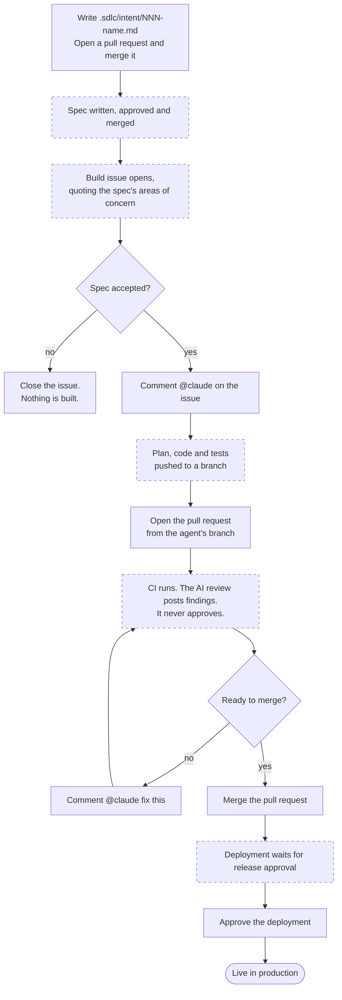

# SDLC guide

How one change travels from an idea to production, how to work in a repository that has adopted the
loop, and how to adopt it in a new one. `README.md` covers what the loop is and why it is shaped
this way.

Adopting the loop commits a project to four things:

- **The files named in `.sdlc/invariant.txt` stop being the project's.** `ci / test` fails if they
  are edited locally. They change by proposing a change upstream.
- **The standard keeps arriving.** `sdlc-update.yml` opens a pull request when a newer tag exists.
  It goes through the project's own CI and review. Merging it is a decision, not an obligation.
- **Every gate stays human.** The agent writes artefacts and findings. It never approves, merges or
  releases. The single automatic approval is the spec, and the pipeline grants it, not the agent.
- **The agent is held to published rules.** `.sdlc/standards/engineering-guardrails.md` arrives with
  the standard and binds every change the agent proposes. The project points `CLAUDE.md` at it once
  and reviews against it; the rules themselves are not the project's to soften.

---

## The loop

A solid outline is a step someone performs. A dashed outline happens on its own.



### The five actions

Everything between them is automatic. Nothing reaches production without a person acting.

| # | Action | Where | Who |
|---|---|---|---|
| 1 | Write the intent, open a pull request, merge it | `.sdlc/intent/<slug>.md` | author, then code owner |
| 2 | Comment `@claude` to accept the spec and start the build | the Build issue | product owner |
| 3 | Open the pull request from the agent's branch | the *Create PR* link | author |
| 4 | Merge once CI and the review look right | the pull request | code owner |
| 5 | Approve the release | the `production` environment | release manager |

One slug — `NNN-<short-name>` — ties the chain together:
`.sdlc/intent/<slug>.md` → `.sdlc/specs/<slug>.md` → `.sdlc/plans/<slug>.md` → pull request.

### What the diagram does not show

**Step 2 is the rejection point.** Closing the Build issue instead of commenting is how a spec is
turned down. A design exists by then; no code has been written. There is no other place in the loop
where a change can be stopped before work begins.

**Three stages produce a file, one produces an issue.** Intent, spec and plan are artefacts, so each
arrives as a pull request. The build stage has no file to show yet, so its gate lives on an issue.

**Three of the four human gates are a merge button.** The fourth is the `production` environment's
required reviewers. The build gate has no merge to attach to, which is why the issue exists.

---

## Working in a repository that has adopted the loop

### The same thing in words

1. **Plan.** *"Use the write-intent skill: \<idea\>."* The agent writes `.sdlc/intent/<slug>.md`.
   Open a pull request; `claude-review` comments; a code owner merges.
2. **Design.** The merge fires `intent-to-spec.yml`. The agent writes `.sdlc/specs/<slug>.md` with
   areas of concern flagged. The pipeline sets `Status: approved (auto)` and auto-merges on green.
3. **Build.** The merge opens a *Build: \<slug\>* issue quoting the concerns. **Nothing is built
   until a person comments `@claude` there.** The agent commits a plan, implements it, runs lint and
   tests, and posts a *Create PR* link. It does not open the pull request itself.
4. **Review.** `ci / test` runs and triages its own failures. `claude-review` posts findings and a
   `REVIEW-TALLY` — comments only, never an approval. `@claude fix this` iterates.
5. **Deploy.** A green CI run on `main` starts `deploy.yml`; the `production` environment's
   reviewers gate it.
6. **Maintain.** `monitor.yml` runs `scripts/detect.sh` on a schedule. Try it with **Run workflow →
   inject `0.052`** (2σ, opens a monitor intent pull request) or `0.2` (3σ, also runs the rollback
   runbook).

To require a product owner on every spec instead of auto-approval, set
`stages.design.gate.approval: manual` in `.sdlc/flow.yaml`.

### What has to be installed locally

Nothing, for the five actions above: every workflow runs on a GitHub-hosted runner, and each human
step is a pull request, a comment or a button. Local tooling is only needed to run the checks before
pushing.

| To run | Needs |
|---|---|
| `make install` / `lint` / `test` | the project's own toolchain |
| `make flow-check` | `yq` (mikefarah). The runners have it; a laptop may not |
| `make template-check` | `git`, `python3` |
| `make sdlc-update` | `git`, `curl`, `tar` |
| Claude Code locally | optional. The same hooks apply: `SDLC_FIX_MODE=1` freezes the paths in `.sdlc/protected-paths.txt`, `SDLC_STAGE=build` freezes `.sdlc/intent/` and `.sdlc/specs/` |

`gh` is not required. The only script that uses it, `.sdlc/scripts/open_pr.sh`, runs on the runner.

---

## Adopting the loop in a new repository

### Prerequisites

- A repository that can be public, or a paid plan. Required reviewers on a `production` environment
  are unavailable on private repositories on the free plan, and converting a repository to private
  silently ignores the protection rules already configured.
- The template must be public unless every consuming repository is also private: a public repository
  cannot call a private repository's reusable workflow.
- `gh` authenticated with the `workflow` scope: `gh auth refresh -h github.com -s workflow`.
- A Claude Code token: `claude setup-token`.

### 1. Bootstrap — one command

```bash
gh repo create <owner>/<app> --template kayshn/poc-sdlc-template --clone --public
cd <app>
./.sdlc/scripts/sdlc_update.sh --source kayshn/poc-sdlc-template
```

That pins the newest tag in `.sdlc/TEMPLATE_VERSION`, repoints every thin caller workflow at it,
deletes the local `_*.yml` bodies — inert in a consumer, because `workflow_call` never self-fires —
and removes the template's own upkeep files.

**Done when** `make template-check` reports everything except *make lint and make test are wired up*.

### 2. Reach the stack — the only blocking step

`make lint` and `make test` ship failing on purpose: a green check that ran nothing is worse than a
red one.

1. **`Makefile`** — replace the bodies of `install`, `lint`, `test`, `format`, `run`. Keep the names;
   the workflows call them and nothing else. Leave everything below the *nothing below this line is
   stack-specific* marker alone. No workflow contains toolchain setup: the runners preinstall
   `python3`, `node`, `jq`, `awk` and `yq`, and `make install` provisions the rest.
2. **`.gitignore`** — add build output and dependency directories.

**Done when** `make install && make lint && make test && make flow-check && make template-check` is
green locally. That is the whole of CI.

### 3. Make the agent useful

No check enforces any of this. It is the difference between an agent that helps and one that
produces plausible noise.

| File | Do |
|---|---|
| `CLAUDE.md` | Fill in every `<...>`. *Conventions* and *Things the agent gets wrong* are what steer it — name real symbols, not principles. Keep it short; a long file is a file the agent skims. Leave the `@.sdlc/standards/engineering-guardrails.md` line alone: it is how the rules reach every session, and `make template-check` fails without it |
| `.sdlc/REVIEW.md` | Rewrite the *Security* bullet for the project's real risks. Keep the four passes, the severities and the `REVIEW-TALLY` line — the pipeline parses them |
| `.sdlc/standards/project-guardrails.md` | Optional, and the project's own. Rules specific to this stack, alongside the invariant `engineering-guardrails.md`. Import it from `CLAUDE.md` the same way |
| `.claude/skills/secure-api-review/SKILL.md` | Rewrite in terms of the project's own helpers and types, or delete it and its references in `CLAUDE.md`, `.sdlc/REVIEW.md`, `claude-review.yml`, `flow.yaml` and `write-spec`. Add one skill per policy to enforce at design time |
| `.sdlc/protected-paths.txt` | Point at the test directory. The hook enforcing it is invariant, so this file is the only place the rule can be retargeted |
| `.sdlc/architecture/container.md` | Replace the stub with this system at container level. Every spec from then on either amends it or says `No architectural change.`, and `make flow-check` fails a spec that says neither |
| `.sdlc/flow.yaml` | Set `stages.build.produces` to the real source and test directories. `stages.design.diagram` names the high-level diagram and must point at a file that exists |
| `.claude/hooks/format-on-edit.sh` | Add the formatter for the project's file types. It must never block |
| `.claude/agents/verifier.md` | Say how to exercise the project's behaviour directly, not only through the suite |

### 4. GitHub setup

Two gates live only in GitHub settings and appear in no file in the repository.

1. **Install the Claude GitHub App**: `/install-github-app`, or <https://github.com/apps/claude>.
2. **Repository secrets** (Settings → Secrets and variables → Actions):
   - `CLAUDE_CODE_OAUTH_TOKEN` — from `claude setup-token`, which bills a Claude subscription. An
     API key from the console bills prepaid credits instead and belongs in `ANTHROPIC_API_KEY`; put
     one in `CLAUDE_CODE_OAUTH_TOKEN` and it authenticates but charges the wrong account.
   - `SDLC_BOT_TOKEN` — a fine-grained PAT for this repository with *Contents*, *Pull requests*,
     *Issues* and *Workflows* read/write. Pull requests opened with the default `GITHUB_TOKEN` **do
     not trigger other workflows**, so without it the spec and monitor pull requests get no CI or
     review; and `GITHUB_TOKEN` cannot push under `.github/workflows/`, which the template-update
     pull request needs.
3. **Allow Actions to create and approve pull requests** (Settings → Actions → General) and **Allow
   auto-merge** (Settings → General). Both are needed for spec auto-approval.
4. **Create a `production` environment** with **required reviewers**. This is the release gate.
   Without reviewers, a merge to `main` deploys straight through.
5. **Protect `main`**: require a pull request, one code-owner approval, and the `ci / test` check.
   Add `evals / suite` to gate changes to the agent's own configuration. On a repository with a
   single maintainer, require **zero** approvals instead: GitHub forbids approving one's own pull
   request, so requiring one deadlocks the loop.

### 5. Later, once the loop is turning

- **`scripts/deploy.sh` / `scripts/rollback.sh`** — point at a real target. Better, expose deploy,
  status and rollback to the agent as MCP tools.
- **`.sdlc/monitoring/metrics.json`** — replace the sample series with a real source; tune
  `bands.json`.
- **`.sdlc/evals/cases/`** — copy `_EXAMPLE/` to add cases for the project's own policies. Folders
  starting with `_` are skipped. Treat a regression here like a failing test.

---

## Staying current

`sdlc-update.yml` runs weekly. When a newer tag exists it pulls the invariant layer, repoints the
caller workflows, and opens a *chore: SDLC template vX.Y.Z* pull request. To do it sooner, use
**Actions → SDLC template update → Run workflow**, or run `make sdlc-update` locally and open the
pull request by hand. Pass a tag to move to a specific version:
`./.sdlc/scripts/sdlc_update.sh v1.4.0`.

**What the pull request may contain.** Only files named in `.sdlc/invariant.txt`, the pinned refs in
the callers, and `.sdlc/TEMPLATE_VERSION`. Anything the project owns is never touched, so a diff
that reaches `CLAUDE.md`, the `Makefile` bodies or the source tree is a bug worth reporting upstream.

**Read the release notes, not the diff.** The diff is mostly shell. The notes say what changed and
whether anything is required of the project — a release occasionally asks for a manual step, because
`sdlc_update.sh` cannot edit files the project owns, such as `.claude/settings.json`.

**An upgrade may convert a workflow into a thin caller.** A workflow body that used to live in the
project moves into the standard, and the upgrade replaces the project's copy with a caller that
holds only the triggers. Nothing else can deliver a fix to that body. If the project had edited the
triggers, the edit is in the diff: reapply it to the caller, or pass it as an input to the callable.
`make template-check` names any caller that still carries a body, and the remedy is
`./.sdlc/scripts/sdlc_update.sh --rewire` — the upgrade is run by the copy of `sdlc_update.sh`
installed *before* it, so the release that teaches it a new way to wire the callers cannot use it
on the way in.

**Three things to expect:**

- **The upgrade pull request gets no AI review.** `claude-code-action` refuses to run when a workflow
  file differs from the version on the default branch, and every upgrade rewrites the pinned refs.
  The check reports success in a few seconds having reviewed nothing. `ci / test` and `evals / suite`
  still run properly.
- **`make template-check` can fail straight after an upgrade.** A release that starts rejecting
  something previously tolerated reports it as a failure for the project to resolve. Upgrades never
  delete a file the project might own: template-upkeep files are removed only on first install,
  because deleting a file called `TODO.md` on every upgrade would eventually destroy a real backlog.
- **Files the template seeds are never backfilled.** `CLAUDE.md`, the `_TEMPLATE.md` artefacts and
  the caller workflows arrive once, at repository creation, and belong to the project from then on.
  Only the invariant layer is redelivered. A repository created before a seeded file existed never
  receives it.

**Skipping a release is safe**; upgrades are cumulative. Staying several versions behind is not
especially risky either, but `check_template.sh` warns on every run until the project catches up.

---

## When something goes wrong

| Symptom | Cause |
|---|---|
| `the invariant layer matches the manifest` fails | A file in `.sdlc/invariant.txt` was edited. `make sdlc-update` restores it; if the change was wanted, propose it upstream |
| `ci.yml calls the standard by ref` fails | A caller was reverted to `uses: ./...`, or a local `_*.yml` came back |
| `CLAUDE.md imports the engineering guardrails` fails | The project predates `v2.2.0`, or the line was deleted while filling in the template. `CLAUDE.md` is the project's, so no upgrade can add it — paste `@.sdlc/standards/engineering-guardrails.md` back in |
| `REVIEW.md keeps the Guardrails pass` fails | Same cause. Copy the *Guardrails* bullet from the template's `.sdlc/REVIEW.md` |
| `design: a high-level diagram is declared` fails | The project predates the guardrail G6. Add `diagram: .sdlc/architecture/container.md` under `stages.design` in `.sdlc/flow.yaml` and create the file — both are the project's, so no upgrade can add them |
| `specs/<slug>.md: High-level design` fails | The spec neither shows an amended mermaid view nor states `No architectural change.`. A spec written before G6 existed needs the line added once |
| `workflow was not found` on every run | The template is private and the consumer is public. No setting permits that combination |
| Required check never completes | Either the check is `ci / test`, not `test` — a called workflow reports as `<caller job> / <called job>` — or a check was required from a path-filtered workflow. A skipped run reports no status, so the check stays pending forever |
| Spec pull request opens but never merges | `SDLC_BOT_TOKEN` is missing, so the author is `github-actions[bot]`, which cannot approve its own pull request. Or auto-merge is disabled on the repository |
| Template-update pull request fails to push | `SDLC_BOT_TOKEN` lacks *Workflows* write; it has to rewrite the pinned refs |
| `Permission ... denied` on push from a workflow | `SDLC_BOT_TOKEN` authenticates but lacks *Contents: write* |
| One-person repository cannot merge anything | GitHub forbids approving one's own pull request. Require zero approvals and let the status checks plus the merge button be the gate |
| The eval suite passes suspiciously fast | Check the result artefact for `is_error`. An agent run that failed on billing or auth still exits 0 |
| `Credit balance is too low` | The token is an API key on an account with no credits. A subscription token reports a usage limit instead |
| `make flow-check` says `yq is not installed` | Install mikefarah's `yq` |
| A file the template added recently is missing | Only the invariant layer is redelivered. Seeded files arrive once; copy it across by hand |
